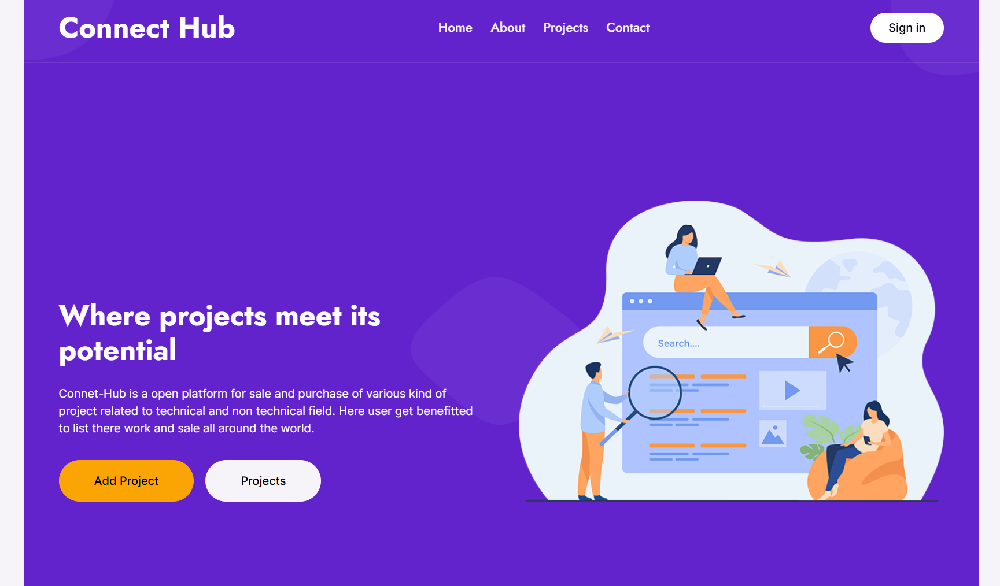
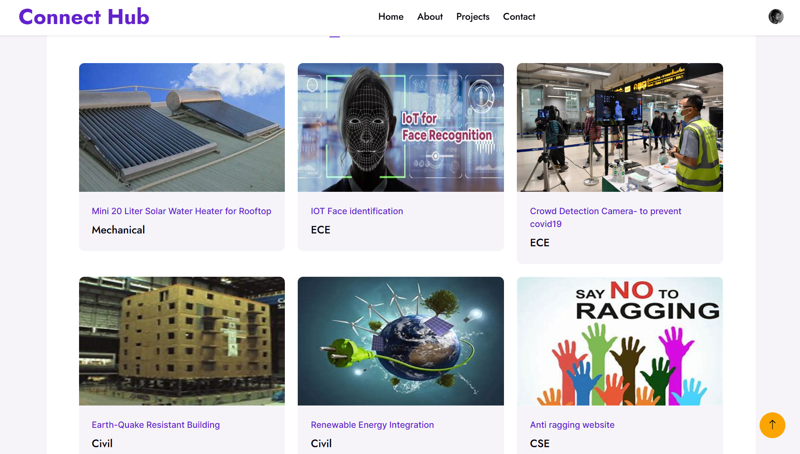

# Connect Hub

**Connect Hub** is a website for posting your own projects and selling them. It also offers features to get project ideas, access free projects, and easily find projects of interest.

### Tech Stack

- **Frontend**: React, Tailwind CSS, Next.js
- **Backend**: Next.js, NextAuth, Supabase

### Features

- **Sell Projects**: Platform to sell your own projects.
- **Get Project Ideas**: Discover new project ideas.
- **Get Free Projects**: Access a variety of free projects.
- **Easy to Find Projects**: Simple and intuitive interface to find projects.

### Links

- [Live Demo](https://connecthub4u.vercel.app/)

